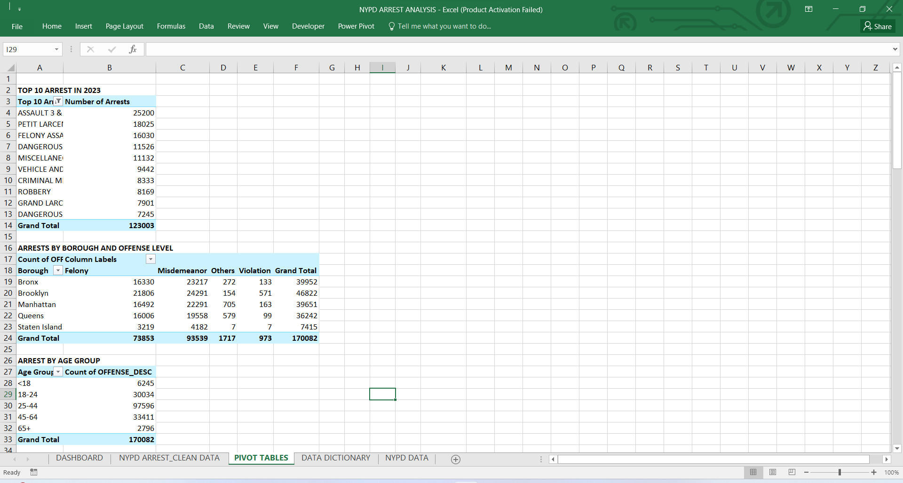
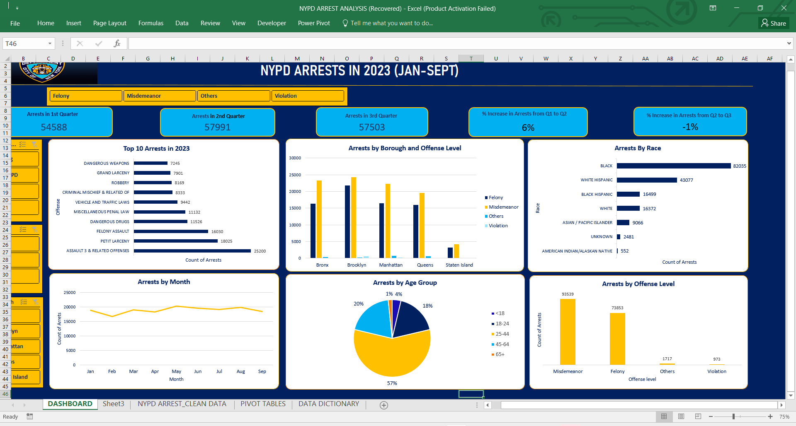

# NYPD-Arrest-Analysis

---
## Introduction

This is a Microsoft Excel  project on the arrests made by the New York Police Department(NYPD) in 2023. It shows the arrests from January to September
This project is done to critically analyze the type of arrests in various jurisdiction and borough also analyzing the profiles of each offender.

## Problem Statement
1. Which bourough in New York had the highest number of arrests?
2. What is the rate of arrests made based on age group?
3. What is the level of arrests made in each month and quarter?
4. Which age group subscribed the most?
5. What are the top 10 offenses in New York?
6. What race is the most offender?

## Skills Demonstrated
The following Microsoft Excel features that were used are:
- Pivot tables
- Pivot chart
- Formatting
- Filters
- Sorting
- Removing nulls
- Connecting slicers to charts

## Pivot Tables

After cleaning, sorting and filtering the data sets, I created pivots tables to compare patterns and trends in the data. 
The pivot tables provides a breakdown of the large dataset for better analysis and undesrstanding.

## Visualization

It comprises of various charts showing:
1. Top 10 arrests in 2023
2. Arrests by borough and offense level
3. Arrests by month and race
4. Arrests by Jurisdiction code
5. Arrests by age group
6. Slicers based on offense level, sex and borough

 ## Analysis
In 2022, Netflix generated a revenue of $30,635
The total number of users is 2448.
The total monthly subscriptions is 25,150.

The country that generated the hightest revenue is Spain with a revenue of $5,597 followed by United States and Canada.
Also, Spain has the highest number of users. Though Spain has the highest number of users, it did not generate the highest total monthly subscriptions.
United states had the highest monthly susbcriptions while Italy generated the least.
There isn't a lot of differenece in the revenue generated from France, Uk, Australia, Brazil, Germany, Italy and Mexico

The subscription type that accounted for the highest revenue of $12,248 is Basic type.It accounts for almost 40% of the total revenue.
The standard type generated the least revenue.

The age group of users that subscribe to Netflix the most are people aged between 41-51 years while people between 26-30years subscribe the least.
The devices used the most to access Netflix is laptops.

## Recommendation
I will recommend that ads about the premium subscription be targeted to the basic subscribers informing them about the benefits of upgrading as this would increase revenue.
Discount on subscriptions can be offered to countries like France, Uk, Australia, Brazil, Germany, Italy and Mexico. This is to encourage existing users to upgrade and give them a feel and experience of the premium subscription and increase the number of users.

## Data Source
This data was gotten from Kaggle.
https://www.kaggle.com/datasets/arnavsmayan/netflix-userbase-dataset 
