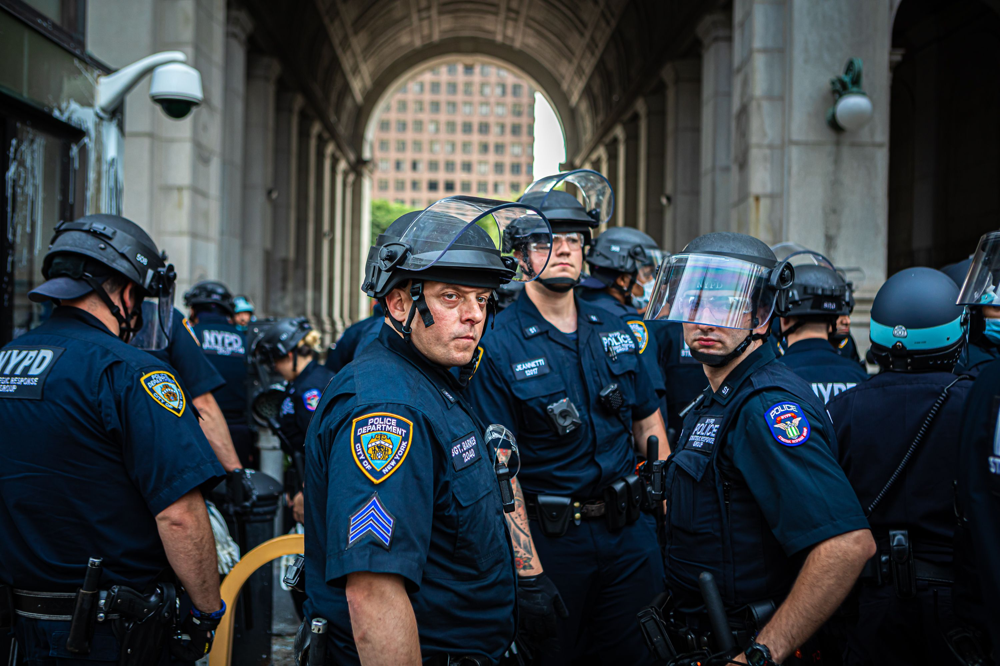

# NYPD-Arrest-Analysis

---
## Introduction

This is a Microsoft Excel  project on the arrests made by the New York Police Department(NYPD) in 2023. It shows the arrests from January to September
This project is done to critically analyze the type of arrests in various jurisdiction and borough also analyzing the profiles of each offender.

## Problem Statement
1. Which bourough in New York had the highest number of arrests?
2. What is the rate of arrests made based on age group?
3. What is the level of arrests made in each month and quarter?
4. Which age group subscribed the most?
5. What are the top 10 offenses in New York?
6. What race is the most offender?

## Skills Demonstrated
The following Microsoft Excel features that were used are:
- Pivot tables
- Pivot chart
- Formatting
- Filters
- Sorting
- Removing nulls
- Connecting slicers to charts

## Pivot Tables

After cleaning, sorting and filtering the data sets, I created pivots tables to compare patterns and trends in the data. 
The pivot tables provides a breakdown of the large dataset for better analysis and undesrstanding.

## Slicers
Slicers like jurisdiction code, sex, borough were created in order to filter the the chart for the exact information that is needed. 

## Visualization

It comprises of various charts showing:
1. Top 10 arrests in 2023
2. Arrests by borough and offense level
3. Arrests by month and race
4. Arrests by Jurisdiction code
5. Arrests by age group
6. Slicers based on offense level, sex and borough

 ## Analysis
The visuals show that the second quarter recorded the highest number of arrests followed by the third and first quarter.
From the charts, it can be concluded that the highest arrest made was in Brookyln with over 46,000 arrests while Staten Island has the least number of arrests. It can be deduced that the reason why the arrests level was low in Staten Island is beacuse it is the least populated among the bouroughs in New York city.

The analysis depicts that most of the people arrested are blacks with 82,035 arrests followed by the white hispanic. Out of the total number of people arrested, there are 2,481 people whose race is unknown.

On the top 10 chart, the number one cause for arrest is assault3 and related  offenses while the least is dangerous weapons comprising of manufacture, transportation, criminal possession and disposal of weapons.

The dashboard shows that offenders with age group 25-44 commit most of the offenses followed by those that are 45-64 years while people that are 65 years and above commit the least offenses.
 
## Recommendation
I would recommend that there should be more sensitization on the dangers of committing crimes and the consequences.

The Police department need to transfer more polie officers to place that have very high crime rate like Brooklyn, Manhanttan, Bronx and Queens.

The Poilice department can go to schools, colleges and universities to hold seminars on anger management, confliction resolution and communication.
## Data Source
This data was gotten from data.gov

https://catalog.data.gov/dataset/nypd-arrest-data-year-to-date

